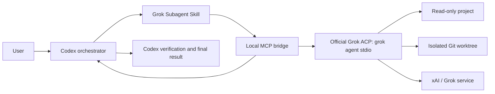

# Grok Subagent for Codex

[](https://github.com/Walvez/grok-subagent/actions/workflows/ci.yml)
[](LICENSE)
[](plugins/grok-subagent/.codex-plugin/plugin.json)

Let Codex call the official Grok Build CLI as a controlled external subagent while Codex remains responsible for orchestration, decisions, and final verification.

[简体中文](README.md) · [Architecture](ARCHITECTURE.md) · [Security](SECURITY.md) · [Contributing](CONTRIBUTING.md)

> Community project. Not affiliated with, endorsed by, or sponsored by OpenAI or xAI. Grok and Grok Build are trademarks of xAI; Codex is a product of OpenAI.

Core capabilities:

- **Independent cross-model review:** Grok investigates, reviews code, or challenges a plan; Codex verifies the findings.
- **Managed sessions:** inspect status, continue a conversation, retrieve results, cancel, and close instead of copying one-off answers.
- **Safe defaults:** investigations are read-only; writing requires explicit authorization and an isolated linked Git worktree.

## 60-second quick start

### 1. Install and authenticate Grok Build

You need Node.js 22+, a recent Codex CLI/Desktop build with plugin support, and the official Grok Build CLI.

```bash
curl -fsSL https://x.ai/cli/install.sh | bash
grok
```

### 2. Install the Codex plugin

```bash
codex plugin marketplace add Walvez/grok-subagent
codex plugin add grok-subagent@grok-subagent
```

Start a **new Codex task** after installation so the skill and MCP tools are loaded into the new task context.

### 3. Run the first read-only delegation

Tell Codex:

```text
Use Grok as a read-only subagent to review this project independently.
Return the three most important risks with file-and-line evidence.
Verify the findings before reporting them to me.
```

On success, Codex starts a Grok agent, receives an agent ID, and reads the result when Grok completes. Project files remain unchanged.

## When to use it

| Good fit | Probably unnecessary |
| --- | --- |
| You want an independent review from another model provider | You only need a one-off Grok answer |
| You are reviewing high-risk authentication, payment, permission, or concurrency code | You need a many-provider dashboard and visualization layer |
| You want a migration or implementation plan challenged from the opposing side | Your environment cannot send relevant code or context to xAI |
| You want a second implementation inside an isolated worktree | You require agent sessions to survive Codex/MCP restarts automatically |

## How it works



The bridge is an orchestration adapter, not another full coding-agent framework. The official Grok Build runtime still owns authentication, inference, file and terminal tools, and model sessions. Codex decides what to delegate and verifies the outcome. See [ARCHITECTURE.md](ARCHITECTURE.md) for protocol and trust boundaries.

## Why this architecture

| Approach | Main trade-off |
| --- | --- |
| Copy and paste between apps | Manual context transfer, no lifecycle control, easy to lose evidence |
| Browser automation | Fragile selectors and session handling; awkward streaming and cancellation |
| Unofficial consumer-session connector | Depends on private interfaces or credentials with uncertain compatibility and security boundaries |
| Raw xAI API wrapper | Rebuilds tools, sessions, permissions, and sandboxing, and may require separate API setup and billing |
| Native Codex subagents | Tighter integration, but generally within the same platform and model family |
| **This plugin: official Grok CLI + ACP + MCP** | Keeps the supported Grok agent runtime and adds a narrow, auditable Codex control layer |

This plugin does not replace native Codex subagents. Native subagents are a better fit for same-platform parallel decomposition. This plugin is useful when you specifically want **model diversity**: Grok provides an independent review or isolated implementation, and Codex remains the final verifier.

## Common workflows

### Independent investigation

```text
Use Grok as a read-only subagent to inspect this repository's authentication flow.
Ask it for file-and-line evidence. You remain responsible for the final diagnosis.
```

### Second-opinion code review

```text
Have Grok independently review the current diff for correctness, security,
and concurrency issues. Report only findings you can verify yourself.
```

### Plan red-team

```text
Ask Grok to challenge this migration plan. Focus on rollback gaps, data-loss risks,
unsupported assumptions, and missing tests. Then prioritize the strongest objections.
```

### Isolated implementation

```text
Create an isolated linked Git worktree and let Grok implement the parser change there.
Do not merge, commit, or push. Review the diff and run tests yourself afterward.
```

Writing mode requires explicit user authorization. The plugin rejects the primary checkout and any directory whose `.git` entry is not a linked-worktree file. Follow-ups to a writing agent must confirm that they remain within the same authorized write scope.

## Security model at a glance

| Mode | Filesystem access | Startup condition | Responsibility afterward |
| --- | --- | --- | --- |
| Read-only investigation | Grok `read-only` sandbox | Any readable absolute directory | Codex verifies files, commands, and conclusions |
| Writing worker | Grok `workspace` sandbox, limited to a linked worktree | Explicit user authorization plus bridge worktree validation | Codex inspects the diff and reruns tests |

Important boundaries:

- Grok is an external model. Files it reads or context it receives may be sent to xAI according to your Grok/xAI plan and policies.
- Authentication is owned by the official Grok CLI. The plugin does not persist or independently manage credentials, and it does not expose them to Codex. When `XAI_API_KEY` is present, the bridge only passes it to the official Grok CLI child process.
- Never delegate secrets, tokens, production `.env` files, SSH private keys, or unrelated personal data.
- The bridge filters the child environment, but explicitly passed variables and `XAI_API_KEY` remain visible to the official CLI process.
- Read-only mode prevents project writes, but Grok may still write under `~/.grok` and temporary directories. On macOS, do not treat it as an offline network boundary.
- Model agreement is not verification, and repository content may prompt-inject either model.
- The bridge discards thought chunks and retains only bounded public text, plan entries, tool titles/status, and sanitized errors in memory.

Read [SECURITY.md](SECURITY.md) before using the plugin on private code.

## Nine management tools

| Tool | Purpose | Filesystem mode |
| --- | --- | --- |
| `grok_spawn_readonly` | Start an independent investigation, review, or plan analysis | Grok `read-only` sandbox |
| `grok_spawn_worker` | Implement inside an approved linked worktree | Grok `workspace` sandbox + bridge guard |
| `grok_handoff_interactive` | Open an interactive Grok TUI in a new macOS Terminal window and stop Codex supervision after prompt handoff | Read-only or a Grok-created isolated worktree |
| `grok_status` | Read lifecycle, elapsed time, plan, recent tool activity, and a public-response preview; optionally wait for a newer revision | Read-only |
| `grok_result` | Read the public answer, optionally waiting briefly | Read-only |
| `grok_send` | Send a focused follow-up; writing sessions require renewed scope confirmation | Inherits session mode |
| `grok_cancel` | Cancel the active turn | Control operation |
| `grok_close` | Terminate and remove the Grok process | Control operation |
| `grok_list` | List agents owned by the current bridge | Read-only |

The bridge permits at most three open Grok processes. The skill recommends one by default and two only for genuinely independent work.

### Interactive handoff mode

When the user explicitly asks Codex to hand a task fully to Grok and interact with it directly, Codex turns the goal, scope, known context, completion criteria, and restrictions into a self-contained prompt. `grok_handoff_interactive` then opens a new macOS Terminal window. The Grok TUI is user-supervised from that point onward: Codex does not poll it, close it automatically, or pretend to know its current state.

Read-only work uses Grok's `read-only` sandbox. Implementation work uses `--worktree` to create an isolated worktree and accepts file edits there, while commits, pushes, publication, and other external actions still require explicit authorization in the Grok window. The user can return to Codex afterward for independent diff, test, and claim verification.

### How visible progress works

While Grok is running, the skill asks Codex to use `grok_status` for incremental waits of up to 30 seconds and relay material plan steps, tool status, elapsed time, or public-response previews as concise progress messages in the Codex task. It also emits a heartbeat within 60 seconds when Grok exposes no new detail. The bridge never forwards private chain-of-thought, so this is verifiable work status rather than hidden reasoning text.

## Requirements and compatibility

- macOS, Linux, or WSL;
- Node.js 22 or newer;
- a recent Codex CLI/Desktop build with plugin support;
- the official Grok Build CLI, authenticated locally;
- Git when using writing workers.

Last verified environment (2026-07-17): macOS, Grok CLI `0.2.101`, `grok-4.5`, and a browser-authenticated SuperGrok account. The plugin also follows other authentication methods supported by the official CLI, including `XAI_API_KEY`, without implementing authentication itself.

Official references: [Grok Build overview](https://docs.x.ai/build/overview), [Headless & ACP](https://docs.x.ai/build/cli/headless-scripting), and [CLI reference](https://docs.x.ai/build/cli/reference).

## Configuration

The plugin has no npm runtime dependencies and stores no credentials.

| Variable | Meaning | Default |
| --- | --- | --- |
| `GROK_BIN` | Absolute path or command name for the official Grok CLI | `~/.grok/bin/grok`, then `grok` |
| `GROK_MODEL` | Default Grok model ID | `grok-4.5` |
| `GROK_PASSTHROUGH_ENV` | Comma-separated extra environment-variable names to pass to Grok | unset |

The model can also be selected per agent. Grok receives a minimal system environment plus `XAI_API_KEY` when present. Other host variables are not inherited unless their names are explicitly listed in `GROK_PASSTHROUGH_ENV`.

## Local development and tests

```bash
git clone https://github.com/Walvez/grok-subagent.git
cd grok-subagent
codex plugin marketplace add "$PWD"
codex plugin add grok-subagent@grok-subagent
```

Run the deterministic checks without installing project dependencies:

```bash
npm test
```

The authenticated end-to-end test consumes a small amount of Grok usage:

```bash
npm run test:e2e
```

Set `GROK_E2E_CWD=/absolute/project/path` to select another read-only target. The test also confirms that writing mode rejects a primary checkout.

Upgrade a Git marketplace snapshot with:

```bash
codex plugin marketplace upgrade grok-subagent
codex plugin add grok-subagent@grok-subagent
```

## Current limitations

- Agent lists are in memory and are not restored after the MCP bridge closes.
- Public answer text is bounded to prevent unbounded memory growth.
- The bridge does not merge, commit, push, or delete worktrees.
- Grok is an external ACP worker exposed through MCP, not a native Codex team subagent.
- Grok CLI behavior, model names, and sandbox implementation may change. Pin or centrally manage Grok versions in sensitive environments.

## License

MIT. See [LICENSE](LICENSE).
