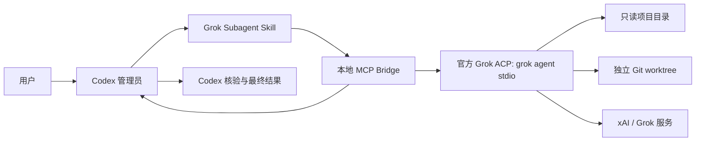

# Grok Subagent for Codex

[](https://github.com/Walvez/grok-subagent/actions/workflows/ci.yml)
[](LICENSE)
[](plugins/grok-subagent/.codex-plugin/plugin.json)

让 Codex 通过官方 Grok Build CLI 调用 Grok 作为受控的外部子 Agent，同时由 Codex 统一负责任务编排、结论判断和最终验证。

[English](README.en.md) · [架构说明](ARCHITECTURE.md) · [安全策略](SECURITY.md) · [参与贡献](CONTRIBUTING.md)

> 这是社区项目，与 OpenAI、xAI 均无隶属、赞助或官方背书关系。Grok 和 Grok Build 是 xAI 的商标；Codex 是 OpenAI 的产品。

核心能力：

- **异构模型复核**：让 Grok 独立调查、审查代码或反驳方案，再由 Codex 核验结论；
- **完整会话管理**：支持状态查看、持续追问、结果读取、取消和关闭，而不是一次性复制答案；
- **默认安全隔离**：调查默认只读；写入必须经过明确授权，并且只能发生在独立 linked Git worktree 中。

## 60 秒快速开始

### 1. 安装并登录 Grok Build

需要 Node.js 22+、支持插件的新版 Codex CLI/Desktop，以及官方 Grok Build CLI。

```bash
curl -fsSL https://x.ai/cli/install.sh | bash
grok
```

### 2. 安装 Codex 插件

```bash
codex plugin marketplace add Walvez/grok-subagent
codex plugin add grok-subagent@walvez-grok
```

安装后请**新建一个 Codex 任务**，让 Skill 和 MCP 工具进入新的任务上下文。

### 3. 发起第一次只读调用

在新任务中直接告诉 Codex：

```text
让 Grok 作为只读子 Agent 独立审查当前项目，列出最重要的三个风险，
要求提供文件和行号证据。你负责核验后再向我报告。
```

成功时，Codex 会启动一个 Grok Agent、获得 Agent ID，并在 Grok 完成后读取结果；项目文件不会被修改。

## 什么时候适合使用

| 适合 | 可能不需要 |
| --- | --- |
| 需要不同厂商模型独立复核 | 只想向 Grok 提一个一次性问题 |
| 审查认证、支付、权限、并发等高风险代码 | 需要同时管理许多模型和可视化面板 |
| 从反方角度检查迁移或实施方案 | 环境不允许把相关代码或上下文发送给 xAI |
| 在隔离 worktree 中尝试第二份实现 | 要求 Agent 会话在 Codex/MCP 重启后自动恢复 |

## 工作原理



这个 Bridge 是编排适配器，不是另一个完整的 coding-agent 框架。认证、推理、文件和终端工具、模型会话仍由官方 Grok Build 运行时负责；Codex 决定委派什么，并验证最终结果。协议与信任边界见 [ARCHITECTURE.md](ARCHITECTURE.md)。

## 为什么采用这种架构

| 方法 | 主要取舍 |
| --- | --- |
| 两边手工复制 | 上下文容易遗漏，无法统一管理状态、取消和验证 |
| 浏览器自动化 | 页面和选择器容易变化，流式输出与会话控制较脆弱 |
| 非官方消费者会话接口 | 依赖私有接口或凭据，兼容性与安全边界难以保证 |
| 自行封装 xAI API | 需要重新实现工具、会话、权限和沙箱，并可能需要单独 API 配置与计费 |
| Codex 原生子 Agent | 集成更紧密，但通常仍属于同一平台和模型体系 |
| **本插件：官方 Grok CLI + ACP + MCP** | 保留官方 Grok Agent 运行时，只增加一层小而透明的 Codex 控制接口 |

本插件不是 Codex 原生子 Agent 的替代品。原生子 Agent 更适合同平台内的并行拆分；本插件适合需要**模型多样性**时，让 Grok 提供独立意见或隔离实现，再由 Codex 统一验收。

## 常用场景

### 独立排查故障

```text
让 Grok 作为只读子 Agent 独立检查这个项目的登录失败问题，
要求给出文件和行号证据。你负责核验后再下最终结论。
```

### 第二模型代码审查

```text
让 Grok 独立审查当前 diff，重点找正确性、安全性和并发问题。
把它的结论与你自己的审查对照，只报告经过验证的问题。
```

### 反方审查实施方案

```text
让 Grok 从反方角度审查这个迁移计划，寻找回滚缺口、数据丢失风险、
没有证据的假设和缺失测试。最后由你整理优先级。
```

### 独立 worktree 实现

```text
创建一个独立 linked Git worktree，让 Grok 在里面实现解析器修改。
不要提交、合并或推送。完成后由你审查 diff 并运行测试。
```

写入模式必须得到用户明确授权。插件会拒绝主检出目录，也会拒绝 `.git` 不是 worktree 文件的普通目录；对写入 Agent 继续追问时，还必须再次确认没有超出已获批的写入范围。

## 安全模型一览

| 模式 | 文件权限 | 启动条件 | 完成后的责任 |
| --- | --- | --- | --- |
| 只读调查 | Grok `read-only` 沙箱 | 任意可读的绝对目录 | Codex 核验文件、命令和结论 |
| 写入 Worker | Grok `workspace` 沙箱，仅限 linked worktree | 用户明确授权，且 Bridge 通过 worktree 检查 | Codex 检查 diff 并重新运行测试 |

重要边界：

- Grok 是外部模型。它读取的文件和收到的上下文可能按照你的 Grok/xAI 套餐与政策发送到 xAI；
- 认证由官方 Grok CLI 管理。插件不持久化或独立管理凭据，也不会把凭据交给 Codex；如果存在 `XAI_API_KEY`，Bridge 只会将其传递给官方 Grok CLI 子进程；
- 不要委派密钥、Token、生产 `.env`、SSH 私钥或无关个人资料；
- Bridge 会过滤子进程环境，但显式放行的变量和 `XAI_API_KEY` 仍对官方 CLI 进程可见；
- 只读沙箱阻止项目写入，但 Grok 仍可写入 `~/.grok` 和临时目录；macOS 上不能把它视为离线网络隔离；
- 两个模型得出相同结论不等于事实已经验证，仓库内容也可能包含提示注入；
- Bridge 不保存思维链，只在内存中保留有长度限制的公开回答、计划、工具名称/状态和脱敏错误。

在私有代码上使用前，请阅读 [SECURITY.md](SECURITY.md)。

## 九个管理工具

| 工具 | 用途 | 文件系统模式 |
| --- | --- | --- |
| `grok_spawn_readonly` | 启动独立调查、审查或方案分析 | Grok `read-only` 沙箱 |
| `grok_spawn_worker` | 在获批的 linked worktree 中执行实现任务 | Grok `workspace` 沙箱 + Bridge 检查 |
| `grok_handoff_interactive` | 在新的 macOS Terminal 窗口打开可交互 Grok TUI，Codex 完成 prompt 移交后不再监督 | 只读或 Grok 创建的隔离 worktree |
| `grok_status` | 查看生命周期、运行时长、计划、最近工具活动和公开回答片段；支持按进度版本等待增量 | 只读 |
| `grok_result` | 获取公开回答，可短暂等待当前轮次完成 | 只读 |
| `grok_send` | 在同一会话中聚焦追问；写入会话需重新确认范围 | 继承会话模式 |
| `grok_cancel` | 取消当前轮次 | 控制操作 |
| `grok_close` | 终止并移除 Grok 进程 | 控制操作 |
| `grok_list` | 列出当前 Bridge 管理的 Grok Agent | 只读 |

Bridge 最多同时保留三个 Grok 进程；Skill 默认建议只使用一个，只有真正独立的任务才并行使用两个。

### 交互式移交模式

当你明确要求“把任务全权交给 Grok，并让我在窗口里直接沟通”时，Codex 会先把目标、范围、已有上下文、完成标准和禁止事项整理成完整 prompt，再调用 `grok_handoff_interactive` 打开新的 macOS Terminal 窗口。之后 Grok TUI 由你直接监督和追问，Codex 不轮询、不自动收尾，也不会假装知道窗口里的最新状态。

只读任务使用 Grok `read-only` 沙箱；实现任务默认使用 `--worktree` 创建隔离工作区，并自动接受工作区内的文件编辑，但提交、推送、发布和其他外部操作仍需你在 Grok 窗口里另行授权。完成后回到 Codex，Codex 再检查 worktree diff、测试和关键结论。

### 可见进度如何工作

Grok 运行期间，Skill 会让 Codex 用 `grok_status` 做最长 30 秒的增量等待，并把有实质变化的计划步骤、工具状态、运行时长或公开回答片段转成 Codex 任务里的简短进度消息；即使没有新细节，也会在 60 秒内给出一次心跳。Bridge 不转发私有思维链，因此这里展示的是可核验的工作状态，不是模型的隐藏推理文本。

## 要求与兼容性

- macOS、Linux 或 WSL；
- Node.js 22 或更高版本；
- 支持插件的新版 Codex CLI/Desktop；
- 已安装并登录官方 Grok Build CLI；
- 写入模式需要 Git。

最近验证环境（2026-07-17）：macOS、Grok CLI `0.2.101`、`grok-4.5`，以及通过浏览器登录的 SuperGrok 账号。插件也沿用官方 CLI 支持的其他认证方式，例如 `XAI_API_KEY`，但不会自行处理认证流程。

官方参考：[Grok Build](https://docs.x.ai/build/overview)、[ACP 与无头模式](https://docs.x.ai/build/cli/headless-scripting)、[CLI 参数](https://docs.x.ai/build/cli/reference)。

## 配置

本项目没有 npm 运行时依赖，也不保存凭据。

| 环境变量 | 用途 | 默认值 |
| --- | --- | --- |
| `GROK_BIN` | 官方 Grok CLI 的路径或命令名 | `~/.grok/bin/grok`，然后尝试 `grok` |
| `GROK_MODEL` | 默认模型 ID | `grok-4.5` |
| `GROK_PASSTHROUGH_ENV` | 需要额外传给 Grok 的环境变量名，用逗号分隔 | 未设置 |

每次启动 Grok Agent 时也可以单独指定模型。Grok 默认只继承最小系统环境，以及存在时的 `XAI_API_KEY`；其他宿主变量不会自动继承，除非变量名被明确写入 `GROK_PASSTHROUGH_ENV`。

## 本地开发与测试

```bash
git clone https://github.com/Walvez/grok-subagent.git
cd grok-subagent
codex plugin marketplace add "$PWD"
codex plugin add grok-subagent@walvez-grok
```

无需安装项目依赖即可运行确定性检查：

```bash
npm test
```

真实 Grok ACP 端到端测试会消耗少量 Grok 使用额度：

```bash
npm run test:e2e
```

可用 `GROK_E2E_CWD=/绝对路径` 指定只读测试目录。测试还会验证普通主检出目录无法启动写入模式。

升级 Git marketplace 快照：

```bash
codex plugin marketplace upgrade walvez-grok
codex plugin add grok-subagent@walvez-grok
```

从 `0.3.0` 或更早版本升级时，marketplace 标识由 `grok-subagent` 改为
`walvez-grok`，需要执行一次迁移：

```bash
codex plugin remove grok-subagent@grok-subagent
codex plugin marketplace remove grok-subagent
codex plugin marketplace add Walvez/grok-subagent
codex plugin add grok-subagent@walvez-grok
```

迁移后请新建 Codex 任务。后续版本可继续使用上面的常规升级命令。

## 当前限制

- MCP Bridge 关闭后不会恢复之前的内存 Agent 列表；
- 回答文本有长度上限，避免无限占用内存；
- 插件不会自动提交、合并、推送或删除 worktree；
- Grok 是通过 ACP/MCP 接入的外部 Agent，不是 Codex 内部原生团队 Agent；
- Grok CLI、模型名和沙箱行为未来可能改变，高安全环境应固定并集中管理 Grok 版本。

## 开源许可

MIT，见 [LICENSE](LICENSE)。
