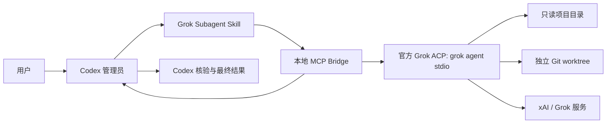

# Grok Subagent for Codex

让 Codex 通过官方 Grok Build CLI 调用 Grok 作为受控的外部子 Agent，同时保留 Codex 作为唯一的任务管理员、决策者和最终验证者。

[English](README.md) · [架构说明](ARCHITECTURE.md) · [安全策略](SECURITY.md) · [参与贡献](CONTRIBUTING.md)

> 这是社区项目，与 OpenAI、xAI 均无隶属或官方背书关系。

## 项目目的

很多人同时订阅 Codex 与 Grok，但实际使用时只能在两个窗口间复制提示词、代码片段和回答。这样不仅麻烦，还会丢失 Agent 工作流最重要的能力：任务边界、持续会话、状态查看、取消、验证和写入隔离。

本插件把官方 `grok agent stdio` ACP 接口封装为 Codex 可调用的 MCP 工具，使 Codex 可以：

- 启动只读 Grok 调查员；
- 让 Grok 独立审查代码、方案或故障原因；
- 在同一 Grok 会话中继续追问；
- 查看状态、执行计划和有限的工具活动；
- 取消或关闭 Grok 进程；
- 经用户明确授权后，只在独立 Git worktree 中让 Grok 修改代码。

## 为什么这是最合适的方法

这里的“最好”专指“让 Codex 管理 Grok 子 Agent”这一目标，并不是所有 Grok 集成都应该这样做。

| 方法 | 主要问题 |
| --- | --- |
| 两边手工复制 | 上下文容易遗漏，无法统一管理状态和验证结果 |
| 浏览器自动化 | 页面和选择器容易变化，登录态风险较高，流式结果与取消都很麻烦 |
| 非官方会话接口 | 可能依赖私有 Token 或内部接口，稳定性和账号风险不可控 |
| 自己封装 xAI API | 还要重新实现工具、会话、权限、沙箱，并可能需要单独 API 配置与计费 |
| **官方 Grok CLI + ACP + 本项目 MCP** | 保留官方 Agent 运行时，只增加一层小而透明的 Codex 控制接口 |

这个方案的关键优势是：

1. **使用官方协议边界**：Grok Build 官方提供 `grok agent stdio` ACP 模式，不需要模拟网页或提取浏览器凭据。
2. **Codex 仍然是管理员**：Codex 负责拆分任务、决定何时调用、核验结论以及最终向用户交付。
3. **不重复开发完整 Agent**：文件读取、终端工具、模型会话等仍由 Grok Build 官方实现负责。
4. **会话可以持续追问**：每个 Grok 子 Agent 对应一个 ACP 进程和会话，不必每次重建上下文。
5. **写入有双重边界**：默认使用系统级只读沙箱；需要写文件时，还必须通过 linked worktree 检查。
6. **认证留在官方 CLI 内**：插件不读取、不保存 Grok Token，也不会把 Token 转交给 Codex。

## 架构



具体协议和信任边界见 [ARCHITECTURE.md](ARCHITECTURE.md)。

## 环境要求

- macOS、Linux 或 WSL；
- Node.js 22 或更高版本；
- 支持插件的新版 Codex CLI/Desktop；
- 已安装并登录官方 Grok Build CLI；
- 写入模式需要 Git。

本项目已在 macOS、Grok CLI `0.2.101`、`grok-4.5` 和浏览器登录的 SuperGrok 账号上完成真实测试。插件同样会沿用官方 CLI 支持的其他认证方式，例如 `XAI_API_KEY`，但不会自行处理这些凭据。

先安装并登录 Grok Build：

```bash
curl -fsSL https://x.ai/cli/install.sh | bash
grok
```

官方文档：[Grok Build](https://docs.x.ai/build/overview)、[ACP 与无头模式](https://docs.x.ai/build/cli/headless-scripting)、[CLI 参数](https://docs.x.ai/build/cli/reference)。

## 安装到 Codex

```bash
codex plugin marketplace add Walvez/grok-subagent
codex plugin add grok-subagent@grok-subagent
```

安装后请新建一个 Codex 任务，让新的 Skill 和 MCP 工具进入任务上下文。

升级：

```bash
codex plugin marketplace upgrade grok-subagent
codex plugin add grok-subagent@grok-subagent
```

## 如何使用

正常情况下直接对 Codex 说自然语言即可，不需要手工调用 MCP 工具。

### 场景一：独立排查故障

```text
让 Grok 作为只读子 Agent 独立检查这个项目的登录失败问题，
要求给出文件和行号证据。你负责核验后再下最终结论。
```

适合避免 Codex 因已有判断产生锚定偏差。

### 场景二：第二模型代码审查

```text
让 Grok 独立审查当前 diff，重点找正确性、安全性和并发问题。
把它的结论与你自己的审查对照，只报告经过验证的问题。
```

适合高风险改动、认证、支付、数据迁移和权限代码。

### 场景三：反驳实施方案

```text
让 Grok 从反方角度审查这个迁移计划，寻找回滚缺口、数据丢失风险、
没有证据的假设和缺失测试。最后由你整理优先级。
```

适合在开工前发现盲点，而不是让两个模型重复生成同一份方案。

### 场景四：独立 worktree 实现

```text
创建一个独立 linked Git worktree，让 Grok 在里面实现解析器修改。
不要提交、合并或推送。完成后由你审查 diff 并运行测试。
```

写入模式必须得到用户明确授权。插件会拒绝主检出目录，也会拒绝 `.git` 不是 worktree 文件的普通目录。
对写入 Agent 继续追问时，Codex 还必须再次确认追问没有超出同一获批写入范围。

### 场景五：文档与测试补盲

```text
让 Grok 只读分析这个模块，列出 README 没写清楚的约束和缺少的测试场景。
你核验源码后再修改文档。
```

## 八个管理工具

| 工具 | 用途 |
| --- | --- |
| `grok_spawn_readonly` | 启动只读调查、审查或方案分析 |
| `grok_spawn_worker` | 在获批的 linked worktree 中执行实现任务 |
| `grok_status` | 查看状态、计划和最近工具活动 |
| `grok_result` | 获取公开回答，可短暂等待完成 |
| `grok_send` | 在同一会话中发送聚焦追问；写入会话需重新确认范围 |
| `grok_cancel` | 取消当前轮次 |
| `grok_close` | 终止并移除 Grok 进程 |
| `grok_list` | 列出当前 bridge 管理的 Grok Agent |

最多同时保留三个 Grok 进程；Skill 默认建议只使用一个，只有真正独立的任务才并行使用两个。

## 配置

本项目没有 npm 运行时依赖，也不保存凭据。

| 环境变量 | 用途 | 默认值 |
| --- | --- | --- |
| `GROK_BIN` | 官方 Grok CLI 的路径或命令名 | `~/.grok/bin/grok`，然后尝试 `grok` |
| `GROK_MODEL` | 默认模型 ID | `grok-4.5` |
| `GROK_PASSTHROUGH_ENV` | 需要额外传给 Grok 的环境变量名，用逗号分隔 | 未设置 |

每次启动 Grok Agent 时也可以单独指定模型。
Grok 默认只继承最小系统环境，以及存在时的 `XAI_API_KEY`。其他宿主凭据不会自动继承，除非变量名被明确写入 `GROK_PASSTHROUGH_ENV`。

## 安全与隐私边界

在私有代码上使用前，请阅读 [SECURITY.md](SECURITY.md)。最重要的限制是：

- Grok 是外部模型。它读取的文件和收到的上下文可能按照你的 xAI/Grok 套餐与政策发送到 xAI。
- 不要委派密钥、Token、生产 `.env`、SSH 私钥或无关个人资料。
- Bridge 会过滤 Grok 子进程环境，但显式放行的变量和 `XAI_API_KEY` 仍对官方 CLI 进程可见。
- 只读沙箱阻止项目写入，但 Grok 仍可写入 `~/.grok` 和临时目录。
- macOS 目前不会强制阻断只读沙箱内子进程的网络访问，不能把它当成离线隔离环境。
- 写入模式虽然同时使用 worktree 检查和 workspace 沙箱，Codex 仍必须审查 diff 并重新运行测试。
- 两个模型得出相同结论不等于事实已经验证；仓库内容也可能包含提示注入。

Bridge 不保存思维链，只在内存中保留有长度限制的公开回答、计划、工具名称/状态和脱敏错误。

## 测试

无需安装项目依赖：

```bash
npm test
```

真实 Grok ACP 端到端测试会消耗少量 Grok 使用额度：

```bash
npm run test:e2e
```

可用 `GROK_E2E_CWD=/绝对路径` 指定只读测试目录。测试还会验证普通目录无法启动写入模式。

## 当前限制

- MCP bridge 关闭后不会恢复之前的内存 Agent 列表；
- 回答文本有长度上限，避免无限占用内存；
- 插件不会自动提交、合并、推送或删除 worktree；
- Grok 是通过 ACP/MCP 接入的外部 Agent，不是 Codex 内部原生同模型子 Agent；
- Grok CLI、模型名和沙箱行为未来可能改变，高安全环境应固定并集中管理 Grok 版本。

## 开源许可

MIT，见 [LICENSE](LICENSE)。
